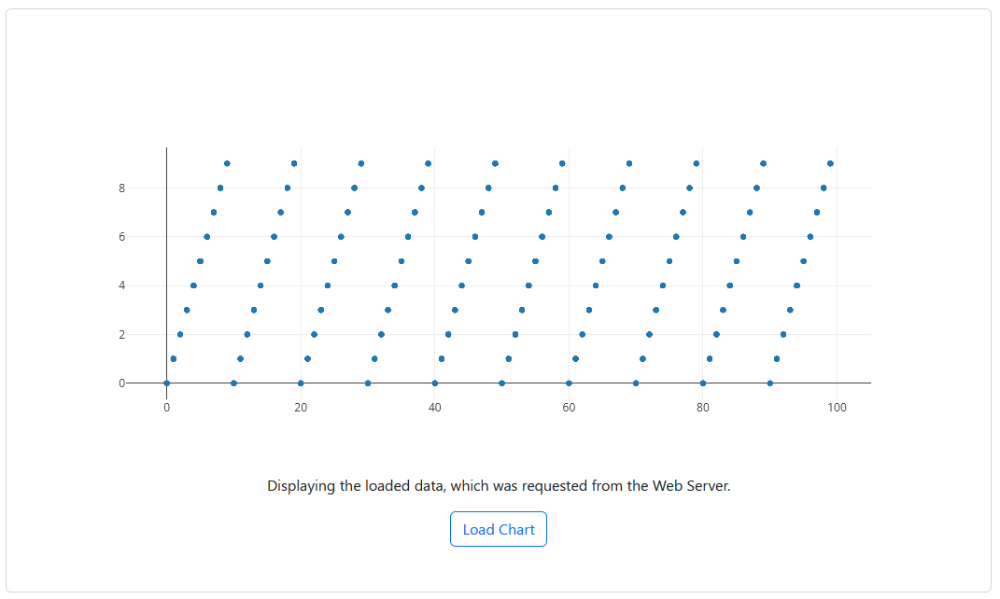

# WebServer
Webserver functionalities with Flask and pandas.

## Building

1. Install python 3.12
2. Run `python -m pip install -r requirements.txt`
2. Install npm
3. CD to `/frontend`
4. Run `npm install`
5. Run `npm run build`

## Starting
1. Start `WebServer.py`

